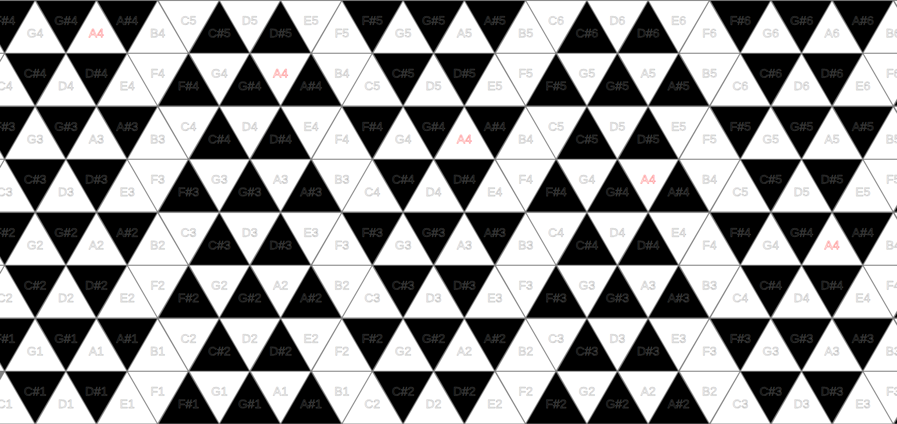

# Barjak keyboard

An **isomorphic multitouch keyboard instrument for touchscreens** featuring a **triangular key layout**.

▶ **Live demo**
https://barjak-keyboard.netlify.app

▶ **GitHub Pages demo**
https://lbarjak.github.io/barjak-keyboard/

▶ **Video demo**
https://www.youtube.com/watch?v=TAFolFpNNH0&lc=

---

# Features

* Multitouch, multitimbral instrument for touchscreens (also playable with a mouse).
* Any number of voices can be played simultaneously.
* Each row acts as a separate instrument, allowing multiple instances of the same sound.
* The triangular keys are less sensitive near their vertices, allowing smooth **whole-note glissandos** without lifting the finger.
* Works immediately with **USB MIDI devices** (MIDI input).

---

# Description

Barjak keyboard is an [isomorphic](https://en.wikipedia.org/wiki/Isomorphic_keyboard) musical keyboard layout designed by **András Barják**.

Instead of square or hexagonal keys, the layout uses **triangular keys**, forming a triangular grid across the surface.

In an **isomorphic keyboard**, every musical interval corresponds to the **same geometric displacement** on the playing surface.
This means that chord shapes, scales, and fingering patterns remain identical in every key.

The triangular key arrangement forms a **triangular lattice**, a natural two-dimensional grid that represents musical intervals in a compact and ergonomic way.

Notes repeat along straight lattice directions, making interval relationships visually apparent and easy to learn.

---

# History and motivation

András Barják has been fascinated by the possibilities of isomorphic keyboards since childhood.

He owns an [Axis 49 MIDI controller](https://www.c-thru-music.com/cgi/?page=prod_axis-49) and has mostly played the [Wicki-Hayden layout](https://en.wikipedia.org/wiki/Wicki%E2%80%93Hayden_note_layout) (also known as the Jammer layout).
As a young pianist he was interested in the [Jankó keyboard](https://en.wikipedia.org/wiki/Jank%C3%B3_keyboard), and as a guitar player he experimented with several isomorphic tunings such as [tritone tuning](https://en.wikipedia.org/wiki/Augmented-fourths_tuning).

The [Hexiano app](https://github.com/lrq3000/hexiano), which mapped both layouts onto a hexagonal grid on Android, also provided inspiration.

The [Wicki-Hayden layout](https://en.wikipedia.org/wiki/Wicki%E2%80%93Hayden_note_layout) offers excellent improvisational possibilities for diatonic music (folk, pop, rock, modal jazz), while the [Jankó layout](https://en.wikipedia.org/wiki/Jank%C3%B3_keyboard) is particularly convenient for chromatic music (jazz and contemporary classical).

However, their advantages and disadvantages are almost mutually exclusive:
the ergonomic modal playability of the Wicki-Hayden layout comes at the cost of reduced chromatic accessibility, while conventional tonal music can be harder to approach on the Jankó layout.

The **Barjak layout** was created as an attempt to combine the strengths of both systems into a single layout.

---

# Advantages

* Fingering patterns are consistent and easy to transpose.
* Ergonomic access to **fourths, fifths, and octaves**.
* Diatonic scales are accessible on triangles of similar orientation without moving the hand horizontally.
* Chromatic ornamentations and passing tones are easily available.
* Chromatic playing remains easier than on a traditional piano keyboard.

---

# Disadvantages

* More complex than the [Wicki-Hayden layout](https://en.wikipedia.org/wiki/Wicki%E2%80%93Hayden_note_layout).
* Mistakes may sound more dissonant compared to other layouts.

---

Code: **László Barják (2020)**
